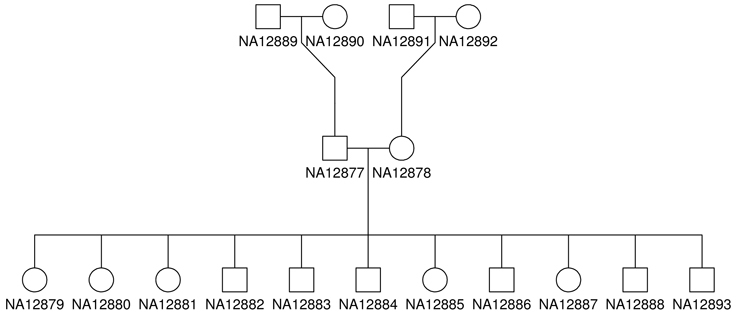

#Introduction to Variants Annotation and Discovery
***By Robert Eveleigh, MSc.***

In this workshop, we will present the main steps involved in variant annotation using the Gemini framework. We will focus on pedigree CEPH 1463 derived from Illumina PCR-free Platinum whole genome data and provide command lines to annotation and query the Gemini database to explore and extract variants of interest. 

We will be working with the CEPH 1463 pedigree found on [Illumina's baseSpace](http://www.illumina.com/platinumgenomes/) or [EMBL repositories](http://www.ebi.ac.uk/ena/data/view/ERP001960)



Due to time and resource constraints, we will provide 1000 preprocessed variants around a known variant of interest was extracted.

This work is licensed under a [Creative Commons Attribution-ShareAlike 3.0 Unported License](http://creativecommons.org/licenses/by-sa/3.0/deed.en_US). This means that you are able to copy, share and modify the work, as long as the result is distributed under the same license.


###Cheat file
* You can find all the unix command lines of this practical in the file: [commands.sh](scripts/command.sh)


###Environment setup

```
cd $HOME
rsync -avP /home/reveleigh/cleanCopy/workshop_variants $HOME/workshop_variants
cd $HOME/workshop_variants

ls -lhtr $HOME/workshop_variants

cd $HOME/workshop_variants

cat bin/var_ann_config.sh:
    export GENOME_FASTA=/home/mBourgey/kyoto_workshop_WGS_2015/references/
    export SNPEFF=/usr/local/bin/snpEff.jar
   

source bin/var_ann_config.sh

cd variants/ceph

```

##Setup Workspace

The initial structure of your folders should look like this:
```
<ROOT>
|-- bin/                          # contains environment setup script
|-- ceph/                         # CEPH pedigree directory. Contains the VQSR filtered vcf file
    
```


###Software requirements
These are all already installed, but here are the original links.

* [htslibs](http://www.htslib.org/download/)
* [VT](http://genome.sph.umich.edu/wiki/Vt)
* [SnpEff](http://snpeff.sourceforge.net/)
* [Gemini](http://gemini.readthedocs.org/en/latest/index.html)


   
#Variant exploration and discovery    


Three samples from the CEPH pedigree have been sequenced and processed.  

The raw data has been trimmed, quality read pairs mapped to the reference genome and the resulting bam files have been further processed using indel realigner, fixmates, mark duplicates and base recalibration. 

Variants were called with GATK haplotype caller in GVCF mode, and soft filtered using variant recalibration (VQSR). 

[CEPH1463 report]:(report/index.html)
    
### VCF file
Exploring the [vcf format](http://samtools.github.io/hts-specs/VCFv4.2.pdf)

**Explore the header**

Try these commands:

```
zcat cephPedigree.vqsr.vcf.gz | grep "^##"
``` 

**What is the vcf format version?**

**What genome build was used for variant calling?**

**What version of GATK Haplotype caller was used?**

[Solution](solutions/_vcf_header.md)

**Explore the body of the vcf**
```
zcat cephPedigree.vqsr.vcf.gz | grep -w -A2 "^#CHROM" 
```

**How many samples in this vcf?**

[Solution](solutions/_vcf_body.md)

```
zcat cephPedigree.vqsr.vcf.gz | grep -v "#" | wc -l 
```

**How many variants are in this vcf file?**

[Solution](solutions/_vcf_variants.md)

#Preprocessing vcf file for Gemini 
For best results, the vcf file requires further processing before loading and annotation with Gemini

Additionally, since we are working with a pedigree we can also provide a ped file to represent the metadata 

###Decompose and Normalize vcf with vt

Try command:
```
zcat cephPedigree.vqsr.vcf.gz | sed 's/ID=AD,Number=./ID=AD,Number=R/' | vt decompose -s - | vt normalize -r $GENOME_FASTA/b37.fasta - | bgzip -cf > cephPedigree.vqsr.vt.vcf.gz
```

**How many variants were decomposed and normalized?**

[Solution](solutions/_vt.md)

### snpEff

Try command:
```
java -Xmx4G -jar $SNPEFF -classic -lof \
    -i vcf \
    -o vcf \
    GRCh37.75 \
    cephPedigree.vqsr.vt.vcf.gz | \
    bgzip -cf > cephPedigree.vqsr.vt.snpeff.vcf.gz
```    

Copy snpEFF_summary.html to local and open in browser

```
scp -r <USER>@www.genome.med.kyoto-u.ac.jp:~/workshop_variants/variants/ceph/snpEFF_summary.html ./

click on snpEFF_summary.html
```

##Loading variants in Gemini

**Examine ped file**

Try command:
```
less ceph.ped
```

**Load vcf into a Gemini database**
 
Try command:
```
gemini load -v cephPedigree.vqsr.vt.snpeff.vcf.gz -p ceph.ped -t snpEff cephPedigree.gemini.18.2.db
```


#SQL basics
Let's briefly go over some basic SQL syntax which will be used

**Required:**
  * SELECT statement: fetch data and view from a table. Columns can be a list of comma-separated columns or an asterisk (*) to return all columns
  * FROM clause: specifies the table to query from

**Optional:**  
  * WHERE clause: filter rows in the result set

For more information about SQL see [sqlzoo](http://sqlzoo.net/)

  
#Explore Gemini

###Gemini syntax basics

Gemini utilized SQL language as well as some uniquely coded agruments

```
    --header       : adds a column identifiers to beginning of results table
    --show-samples : added variant_samples, het_samples and homo_alt_samples columns to display which samples contain a particular genotype

```


###Explore Gemini tables

Here we will explore the design or schema of the gemini databases; the collection of tables   

Try command: 

```
gemini db_info cephPedigree.gemini.18.2.db | column -t
```

Output: (For more information see [column descriptions](http://gemini.readthedocs.org/en/latest/content/database_schema.html))

```
    table_name column shows whether information stored applies to:
        * variants
        * variant_impacts
        * samples
        * gene_detailed
        * gene_summary
```


###Explore variants in Gemini (and data check)

First let us check to database to make sure all variants are imported and the samples information is correct.

Check the number of variants matches the number in of variants in the vcf using [gts-by-sample](http://gemini.readthedocs.org/en/latest/content/tools.html#stats-compute-useful-variant-statistics) function

Try command:
```
gemini stats --gts-by-sample cephPedigree.gemini.18.2.db | column -t 
```        

Check that the sample information is correct

```
gemini query --header -q "SELECT * FROM samples" cephPedigree.gemini.18.2.db | column -t
```
        
###Count variants in CYP2C19 gene

Count the number of CYP2C19 variants with and without GATK VQSR PASS filter

Try commands:

```
gemini query -q "SELECT count(*) FROM variants WHERE gene = 'CYP2C19'" cephPedigree.gemini.18.2.db
```

```
gemini query -q "SELECT count(*) FROM variants WHERE filter is NULL AND gene = 'CYP2C19'" cephPedigree.gemini.18.2.db
```

**How many variants were remove using VQSR filtering?** 

[Solution](solutions/_number_of_filtered_variants.md)

    
###Gemini querying with ClinVar

To identify CYP2C19 variant that are associated or causal for a disease utilizing the ClinVar database

Try command:

```
gemini query --header -q "SELECT * FROM variants WHERE \
    clinvar_disease_name is not NULL \
    AND filter is NULL \
    AND gene = 'CYP2C19'" \
    cephPedigree.gemini.18.2.db | column -t
```    
    
One variant is found in CYP2C19 with ClinVar annotations: [rs4244285](http://www.snpedia.com/index.php/Rs4244285)

**We found the known variant!** 
    
Unforunately this generates a lot of columns let's focus the analysis to a specific set of columns related to [dbsnp](http://www.ncbi.nlm.nih.gov/SNP/), snpEFF annotations, the [ExAC](http://exac.broadinstitute.org/) control database, and [ClinVar](http://www.ncbi.nlm.nih.gov/clinvar/)

```
gemini query --header --show-samples -q "SELECT rs_ids, biotype, impact, impact_severity, aaf_adj_exac_afr, aaf_adj_exac_amr, aaf_adj_exac_eas, aaf_adj_exac_sas, clinvar_disease_name, clinvar_sig \
    FROM variants WHERE \ 
    clinvar_disease_name is not NULL \
    AND filter is NULL \
    AND gene = 'CYP2C19'" \
    cephPedigree.gemini.18.2.db | column -t 

```

**What impact did snpEff assign to this variants?**

[Solution](solutions/_snpeff.md)


**For this variant in which population(s) is this variant more frequent in?**

[Solution](solutions/_population.md)

```
    afr = African
    amr = American
    eas = East Asian
    sas = South Asian
```

**What are the genotypes for the three samples?**

[Solution](solutions/_sample_genotypes.md)

##Guidelines for Variant Exploration 
With a prior knowledge of the variant of interest, it is easy to find and validate the present of [rs4244285](http://www.snpedia.com/index.php/Rs4244285)

However, in cases where the answer is unknown, variant prioritization is not trivial. Study design and initial hypotheses will guide the exploration of the results.

Gemini provides tools and annotations to investigate these types of scenarios, but still in caution must be taken in the prioritization of the variants.

    Study design e.g.
        * Pedigrees    :  de novo, autosomal recessive, autosomal dominant, compound heterozygotes, loss of heterozygosity
        * Case-control :  gene level burden/non-burden tests

    Hypotheses e.g. 
        * Complex disease : pathway analysis, protein interaction
        * Rare disease    : pathway analysis, protein interaction, low frequency or lack of presence in known population databases 

    Some guidelines:
        * Variants of interest should contain good sample based depth of coverage (default 10x or more ; more critical for exome data)
        * Start with high impact variants or variants with high CADD or fitscon scores (variants predicted functional, deleterious and pathogentic variants)
        * Genomic features: if found within or near repeat regions, segmental duplications, etc.  Variant could be a false positive.

###Variant Exploration - general query 
Explore the variants data using the general guidelines state above

Try command:
```
gemini query --header --show-samples -q "SELECT chrom, start, end, gene, rs_ids, gt_depths.(*) ,impact, impact_severity, cadd_scaled, aaf_adj_exac_all, clinvar_disease_name, clinvar_sig, rmsk, in_cpg_island, in_segdup FROM variants \
                WHERE filter is NULL AND impact_severity <> 'LOW'" \
                cephPedigree.gemini.18.2.db | column -t
    
```       

**How many variants were identified?** 

[Solution](solutions/_variant_explore.md)

